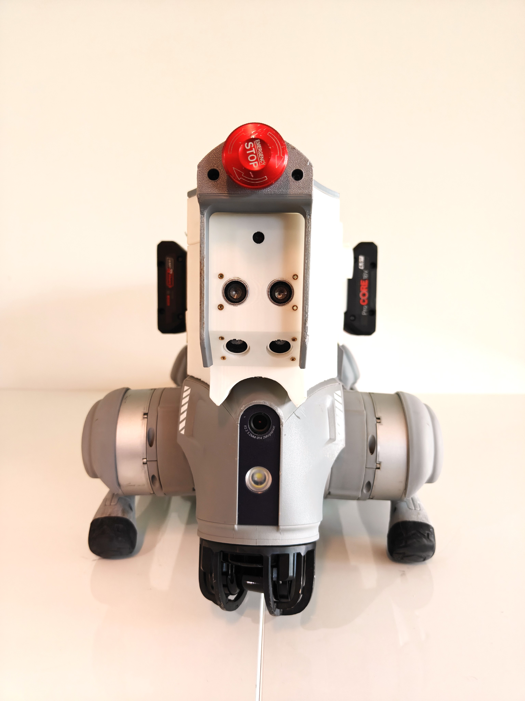
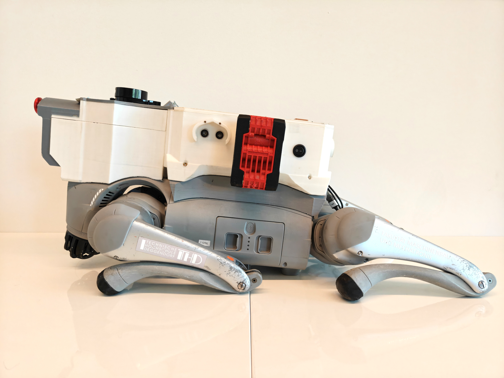

# Auto_Nav_Go2

Low cost auto navigation add-on system for Unitree Go2

  
  &nbsp;&nbsp;
  

<em>Front view (left) and side view (right)</em>

## Overview

Auto_Nav_Go2 is a bolt-on attachment that lets the Unitree Go2 quadruped navigate on its own using low-cost, off-the-shelf electronics. A set of 3D-printed housings mounts onto the robot's back and carries the sensors, an ESP32 controller and its own battery supply.

The system supports two navigation modes:

- **Obstacle avoidance** using ultrasonic sensors, LiDAR and a camera to detect and steer around obstacles.
- **GPS waypoint following** using GPS and an IMU to drive the robot to target locations outdoors.

The ESP32 hosts a local network, so any device (phone, laptop) can connect to it and read the sensor data live.

## Hardware

| Component | Purpose |
|---|---|
| ESP32 | Main controller; hosts a local network for live data access |
| ESP32-Camera | Front-facing vision |
| LiDAR | Distance sensing for obstacle detection |
| Ultrasonic sensors (front and sides) | Short-range obstacle detection |
| GPS module | Outdoor positioning for waypoint navigation |
| IMU | Orientation and heading |
| 2 × 18V tool batteries | Power supply for the add-on |
| Emergency stop button | Immediate manual stop |
| Power switch | Turns the add-on on and off |

## CAD Models

All mechanical parts are in [`models/`](models/) as SolidWorks (`.SLDPRT`) or STEP (`.STEP` / `.step`) files.

| File | Description |
|---|---|
| `robotAdapter.SLDPRT` | Base plate that mounts the add-on to the Go2 |
| `robotAdapter_Lid.STEP` | Lid for the robot adapter |
| `sensorBox_Front.step` | Front sensor housing |
| `sensorBox_Front_Lid.step` | Lid for the front sensor housing |
| `sensorBox_Front_Cap.step` | Cap for the front sensor housing |
| `sensorBox_Back.STEP` | Rear sensor housing |
| `sensorBox_Back_Lid.step` | Lid for the rear sensor housing |
| `sensorHouse.SLDPRT` | Sensor mount housing |
| `electronicsHouse_Bottom.SLDPRT` | Electronics enclosure, bottom half |
| `electronicsHouse_Top.SLDPRT` | Electronics enclosure, top half |
| `batteryAdapter.SLDPRT` | Mount for the 18V tool batteries |
| `GPScap.SLDPRT` | Cover for the GPS module |

## Software

The ESP32 firmware and navigation code will be added to this repository soon.

## License

This project is licensed under the Apache License 2.0. See [LICENSE](LICENSE) for details.
